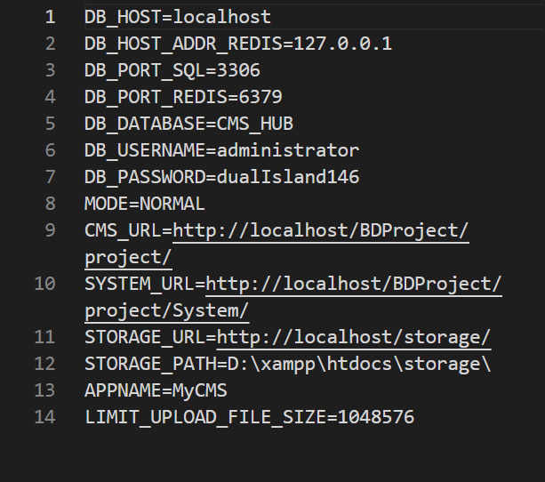

# MyCMS - Content Management System

Project to management content site. Project allows on create multi website with multi subpages. Each page is able to has different menu. In general project is CRUD application based on REST API. 
## Technologies in project
- Redis - extension to management Redis in php [phpredis](https://github.com/phpredis/phpredis)
- PHP
- MariaDB
- JavaScript
- Bootstrap

### Implementation
Connection with MariaDB provide PDO extension. MariaDB is responsible for store data and Redis for usage by system. Data are synchronised between Redis and MariaDB. Layout of site was created with Bootstrap's. JavaScript is responsible for communication with server and handle forms. Application logic is implemented by MVC architecture. Core of application is managed by URL address.

### Configuration
To configure application necessary is saved .env file own settings.

